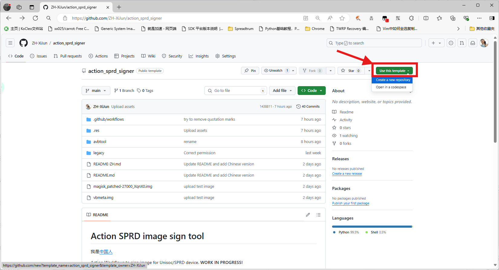
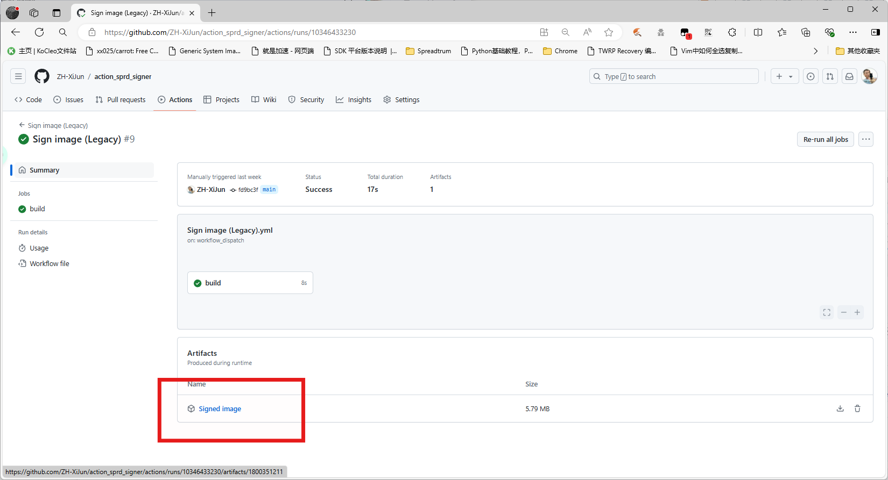

# Action SPRD image sign tool

一个给紫光展锐（下文叫它展讯）设备自动签名镜像的Github工作流。**应该写完了**

> [!Caution]  
> 这个工作流尚未完全测试，且刷机有风险，因此**本人不对你设备的任何损坏负责**

# 介绍

据我所知，展讯现在用了两种签名方法。请根据你的SoC型号选择正确的方法签名

## AVBTOOL签名大法

> [!NOTE]  
> 对应的工作流名：`Sign image (avbtool)`

用avbtool给你的镜像签名。可以看[这个](https://www.hovatek.com/forum/thread-32664.html)和[这个](https://www.hovatek.com/forum/thread-32674.html)教程来了解签名的原理。

打个比方，**SC9832E/SL8541E**就得用这个方法签名，因为它采用了Android启动时验证2.0（就是avb2.0）来验证镜像。

如果我没猜错的话，你这设备有vbmeta分区而且不是空的，那十有八九得用这方法了。

想进一步确认的话，可以看看boot是否能被avbtool正常读取，并确认下vbmeta是否有以`DHTB`为开头的多余内容，可能在文件开头也可能在文件尾部

目前已知使用该方法的SoC：
- SC9832e/SL8541e
- 有待补充...

## BSP签名大法

> [!NOTE]  
> 对应的工作流名：`Sign image (Legacy)`

用展讯自己的BSP签名工具签名镜像。

`FDL1/2, uboot`等等BSP镜像都会用展讯的BSP签名工具签名，但一般不会用来签boot/recovery镜像。只不过，**SC9820E/SL8521E**用了这种方式签名boot/recovery镜像，包括安卓4.4和8.1系统。可能还有其他SoC也会用到，不过我暂时不清楚。

如果我没猜错的话，你这设备没vbmeta分区，或者vbmeta分区是空的，那十有八九得用这方法了。

想进一步确认的话，可以检查下boot是否有一段多出来的内容，以`DHTB`开头，通常在文件开头，`ANDROID!`文件头前面

目前已知使用该方法的SoC：
- SC9820e/SL8521e
- W377e
- 有待补充...

# 使用方法

你需要提供你想要签名的 `boot\recovery` 镜像。如果你用avbtool大法，还需要设备里提出来的原版 `vbmeta` 。**VBMETA镜像里的DHTB头不要删掉！！！**

1. **使用`Fork`或`Use this template`以克隆仓库到你的账号里**

2. **把镜像上传到一个能获取文件直链的地方。你可以把你的镜像上传到你的仓库里，然后用"View raw"拿到文件直链**

3. **打开`Actions`页面，然后选择一个合适的工作流。读读上面的[介绍](#介绍)能帮你选择到正确的工作流**

4. **按下`Run workflow`按钮，然后把参数都填上**

- 如果你用的是`Sign image (Legacy)`，你只用填一个参数就行了。

- 但如果是`Sign image (avbtool)`，那要填的可就多了

- 可能有人不会填第四个参数，这里笔者给个办法，就是回读一下boot/recovery分区，然后把提出来的文件的大小填进去就行了。**如果你操作有误，文件大小可能会发生变化，那样就不准了**

5. **点`Run workflow`之后，啪的一下，很快啊，镜像就签好了。签完的镜像传到Artifacts上了，自行下载即可**

