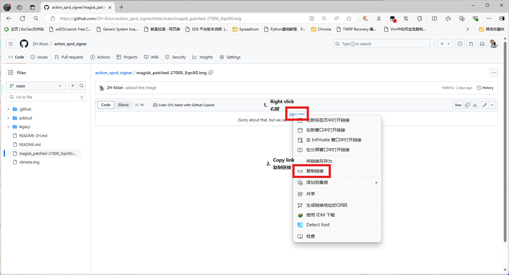
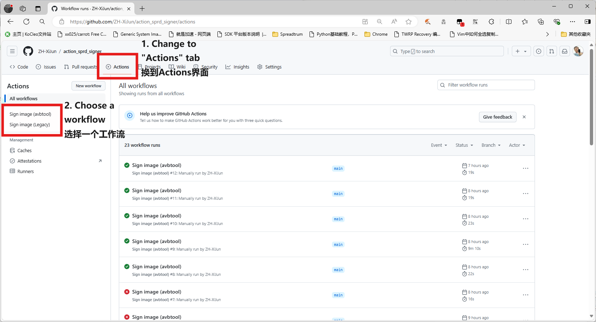
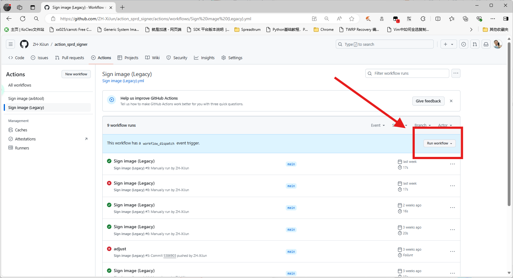
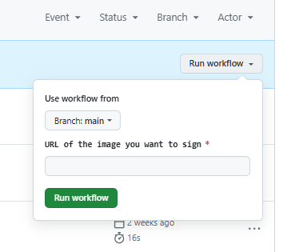
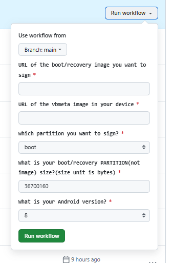

# Action SPRD image sign tool

我是[中国人](README-ZH.md)

Action Workflows to sign image for Unisoc/SPRD device.

> [!Caution]  
> The workflow isn't fully tested. Also, flashing takes risks. Thus, **IM NOT RESPONSIBLE FOR ANY DAMAGE TO YOUR DEVICES**

# Introduce

As I know, two sign method are used by Unisoc. Please choose different signature methods based on your SoC.

## AVBTOOL METHOD

> [!NOTE]  
> Workflow name: `Sign image (avbtool)`

Use `avbtool` to sign the image. Check [here](https://www.hovatek.com/forum/thread-32664.html) and [here](https://www.hovatek.com/forum/thread-32674.html) if you want to know how does it work.

For example, **SC9832E/SL8541E** uses Android Verified Boot 2.0 to sign and verify the image. It should use avbtool method.

Usually, if your device has vbmeta partition and it was not empty, you should use this method.

If you want to further confirm, you can check if your boot image can be recognized by avbtool. Also, check if vbmeta has extra content starting with `DHTB`. It may appears before the common header or at the end of file.

SoCs using this method:
- SC9832e/SL8541e
- ...

## BSP SIGN METHOD

> [!NOTE]  
> Workflow name: `Sign image (Legacy)`

Use Unisoc's BSP sign tool to sign the image. 

BSP sign method often uses on uboot, fdl1/2, etc., excluding boot and recovery image. But **SC9820E/SL8521E** uses this method to sign the boot image, including devices using Android 4.4 and Android 8.1. 

If your device doesn't have vbmeta pertition or it was empty, you may need to use this method to sign your boot image.

If you want to further confirm, you can check whether the boot image has extra content starting with `DHTB`. It usually appears before `!ANDROID` header.

SoCs using this method:
- SC9820e/SL8521e
- W377e
- ...

# How to use

You should provide `boot\recovery` image you want to sign. Original `vbmeta` image from your device is also needed if you are using avbtool method. **DON'T REMOVE DHTB HEADER IN YOUR VBMETA IMAGE!**

1. **Use `Fork` or `Use this template` to clone this reposity to your personal account**

2. **Upload your image to somewhere that can get the DIRECT LINK to your image. For example, I upload my image to this reposity and used "View raw" to get the link.**

3. **Open the `Actions` tab and choose a workflow. Read the [introduce](#introduce) to help you make decision.**

4. **Press `Run workflow` button, and fill in according to the above parameter description, then press `Run workflow`**

- If you choose `Sign image (Legacy)`, there's only one parameter you need to fill in.

- But if you choose `Sign image (avbtool)`, the number of parameters will increase to 5.

- The fourth parameter may be confusing. You can read back the boot/recovery partition of your device **without trimming zeros**. The size of the output file is the value of this parameter.

5. **It wont take much time. After few seconds, the signed image will be uploaded to artifact. You can download it right now and flash into your device!**

